<a href="mailto:michael@lumemiclabs.com?subject=Project%20enquiry">
<picture>
  <source media="(prefers-color-scheme: dark)" srcset="./assets/hero-dark.svg">
  
</picture>
</a>

  
  
  

<b>Hi, I'm Michael Okoh.</b> Businesses come to me when they have a problem that software should already be solving. I talk to the people who will use it, build it in pieces you can try as we go, and hand it over working and written up, so your team is never stuck waiting on me.

<picture>
  <source media="(prefers-color-scheme: dark)" srcset="./assets/stats-dark.svg">
  
</picture>

<picture>
  <source media="(prefers-color-scheme: dark)" srcset="./assets/head-build-dark.svg">
  
</picture>

<picture>
  <source media="(prefers-color-scheme: dark)" srcset="./assets/services-dark.svg">
  
</picture>

<picture>
  <source media="(prefers-color-scheme: dark)" srcset="./assets/head-arch-dark.svg">
  
</picture>

<picture>
  <source media="(prefers-color-scheme: dark)" srcset="./assets/architecture-dark.svg">
  
</picture>

Your customer never waits on slow work. The API answers straight away, the heavy reading happens in the background, and if one AI provider goes down the other takes over.

<picture>
  <source media="(prefers-color-scheme: dark)" srcset="./assets/head-proof-dark.svg">
  
</picture>

<picture>
  <source media="(prefers-color-scheme: dark)" srcset="./assets/work-dark.svg">
  
</picture>

Client names and code stay private. Happy to walk you through any of these on a call.

<picture>
  <source media="(prefers-color-scheme: dark)" srcset="./assets/head-process-dark.svg">
  
</picture>

<picture>
  <source media="(prefers-color-scheme: dark)" srcset="./assets/process-dark.svg">
  
</picture>

<picture>
  <source media="(prefers-color-scheme: dark)" srcset="./assets/head-ways-dark.svg">
  
</picture>

<picture>
  <source media="(prefers-color-scheme: dark)" srcset="./assets/ways-dark.svg">
  
</picture>

<b>For developers checking my thinking</b>

 

| What I chose | Why it matters to you |
|---|---|
| Keep what the AI read apart from what a person typed | A correction someone made by hand is never wiped out by the next automatic read |
| Let fixed rules make the decisions, and let AI only read | The same document always gets the same answer, and anyone can see why |
| Quick pattern matching for easy fields, a full-page read for the rest | That mix is what took reading from over 90 seconds to under 25 |
| Work out hosting costs from real usage, not price lists | You know what it will cost on your busiest day before you sign up |
| Upgrade in small steps, fixing the risky parts first | The business keeps running, and nothing breaks quietly in the background |
| Save long forms one step at a time | People get interrupted, and they should never lose what they typed |

<picture>
  <source media="(prefers-color-scheme: dark)" srcset="./assets/head-stack-dark.svg">
  
</picture>

  <picture>
    <source media="(prefers-color-scheme: dark)" srcset="https://skillicons.dev/icons?i=py,django,fastapi,flask,nodejs,react,nextjs,ts,tailwind,angular&theme=dark">
    
  </picture>
   
  <picture>
    <source media="(prefers-color-scheme: dark)" srcset="https://skillicons.dev/icons?i=postgres,mysql,mongodb,redis,rabbitmq,aws,docker,kubernetes,terraform,githubactions,linux&theme=dark">
    
  </picture>

Plus Celery, OCR and AI models from several providers, with a backup ready if one goes down.

 

<a href="mailto:michael@lumemiclabs.com?subject=Project%20enquiry">
<picture>
  <source media="(prefers-color-scheme: dark)" srcset="./assets/contact-dark.svg">
  
</picture>
</a>
